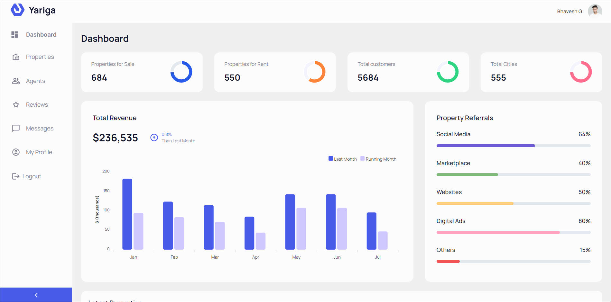
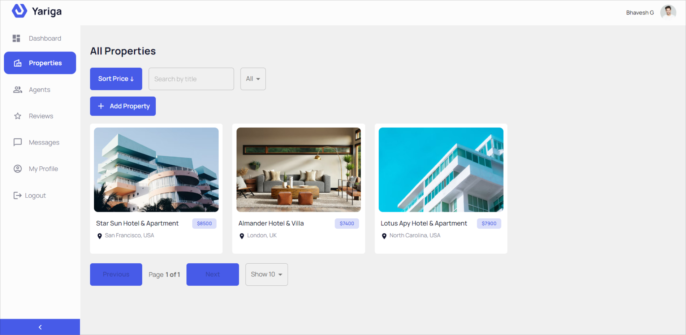
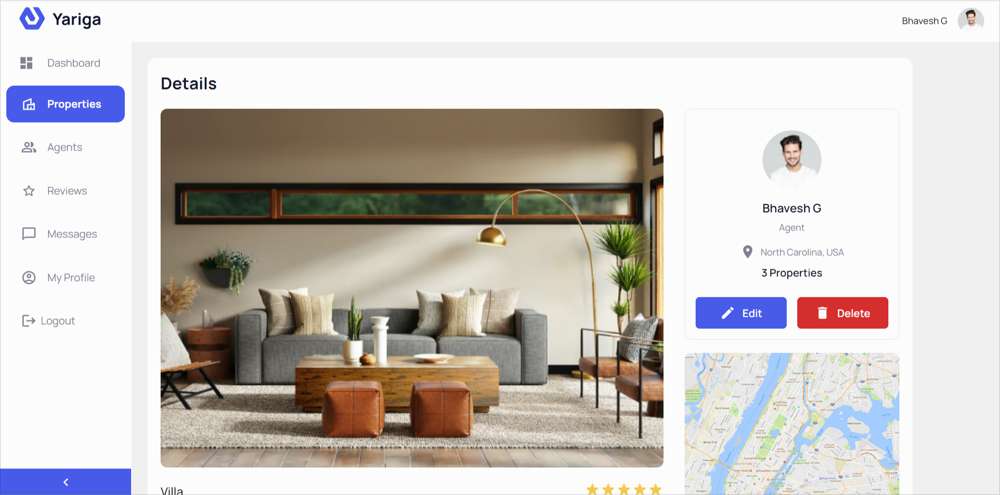
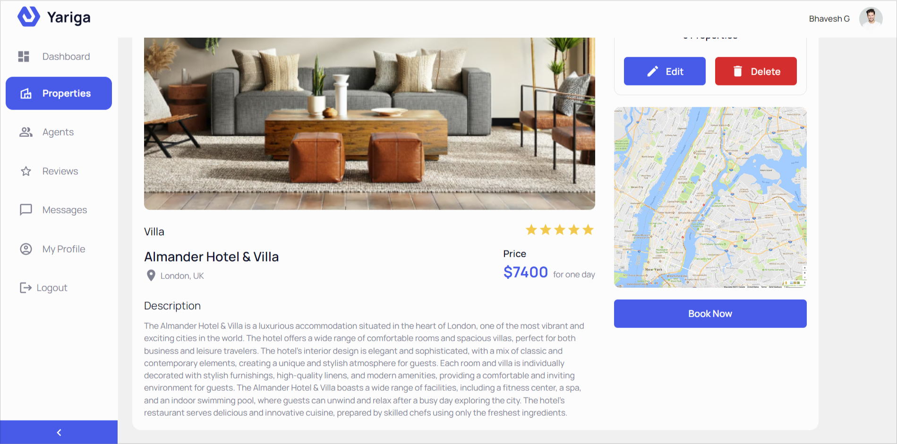
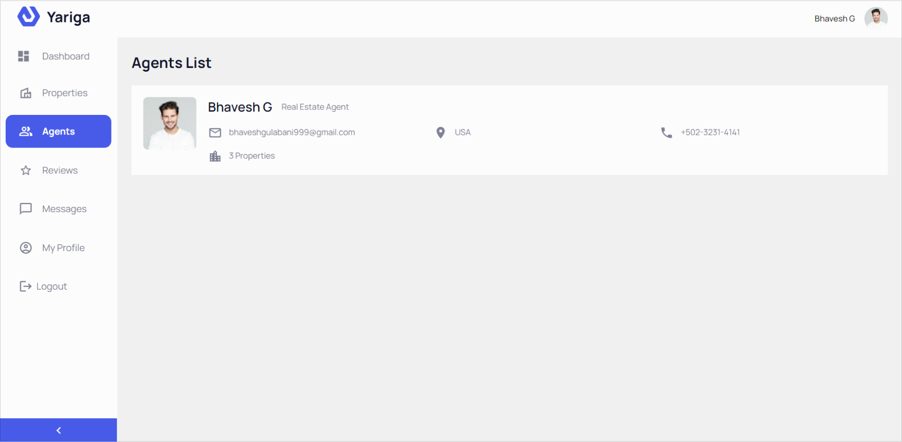
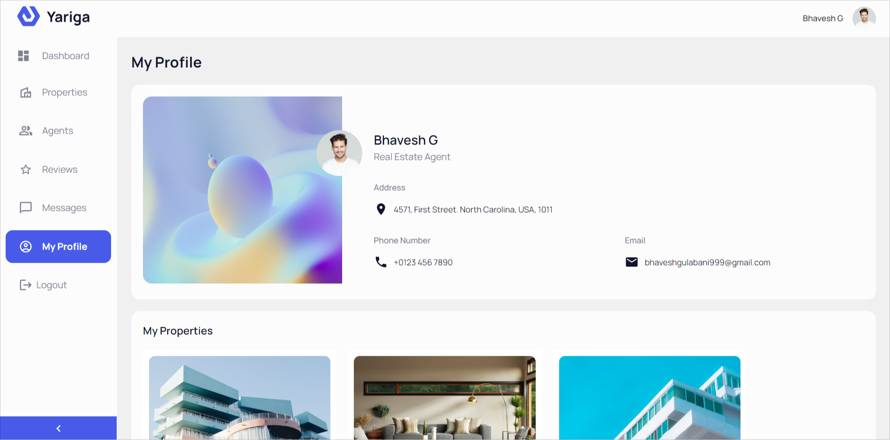

# Yariga

Back-end for a modern real estate dashboard to help agents manage their properties.

## Technology stack

- NodeJS
- Express
- MongoDB

## Application Functionalities

- Google Authentication
- View all properties
- View property details
- Edit property details
- Delete property details
- View real estate agents
- View user profile

## Screenshots

## Note

- You can find the code for this project's front-end [here](https://github.com/bhavesh-gulabani/yariga-client).
